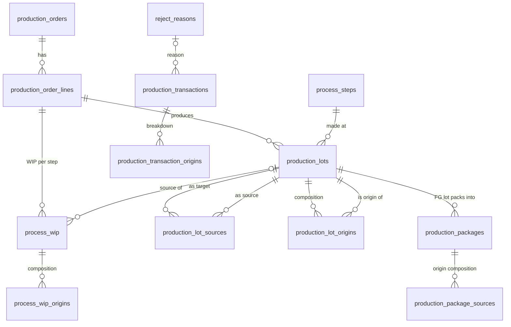

# Production Lot & QR Traceability — Analysis and Implementation Plan

> สถานะ: **Draft รออนุมัติ — ยังไม่เริ่ม coding**
> วันที่: 2026-10-05 · ครอบคลุม `cps-api` (NestJS/PostgreSQL) และ `admin-dashboard` (Next.js 16)
> ต้นทาง requirement: "Production Lot และ QR Code Traceability" (WE → PS → CHECK → INCOME-FG)

ลำดับหัวข้อตาม Expected Output ของ requirement (1–14) และมี §0 สรุปข้อขัดแย้งที่ต้องตัดสินใจก่อน

> **ข้อสรุปที่ใช้เริ่ม Phase 1 (2026-10-05):** ใช้ข้อเสนอใน §0 ทั้งหมด ยกเว้น **C8 เปลี่ยนเป็น 1 Lot ต่อวัน ต่อกะ ต่อขั้นตอน ต่อรายการสินค้า** (บันทึกหลายครั้งในกะเดียวรวมเข้า Lot ที่ยังเปิดอยู่; ปิดรับยอดด้วย `output_closed_at`) · **C13 ไม่ลบข้อมูล** — ใบเดิมตั้ง `tracking_model = 'PACKET'` (อ่านอย่างเดียว) · รอคำตอบจากหน้างาน: ป้าย Lot ขั้นกลาง (C3), เวลาตัดกะ (C8), กล่องเศษ (C9), ขนาดฉลาก
> สรุปสำหรับทีม + UI mockup: https://claude.ai/artifact/T6iFuQBeCQVQyvTHn1nhcB

---

## 0. ข้อขัดแย้ง / สิ่งที่ต้องตัดสินใจก่อน coding

| # | ประเด็น | ข้อเสนอ (default ถ้าไม่ตอบ) |
|---|---|---|
| C1 | ตัวอย่าง FIFO ขัดกันเอง: ข้อความบอก FIFO แล้ว PS ผลิต 200 จะได้ `WE-691001-001 → 200` แต่ Expected Traceability ใช้ `PS-691002-001 = WE-691001-001 150 + WE-691002-001 50` ซึ่งเกิดได้จาก **MANUAL** เท่านั้น | Default = FIFO; ตัวอย่าง 150/50 ใช้เป็น test ของ MANUAL |
| C2 | ตัวอย่างกล่อง `BOX001 = WE1 70 + WE2 30` ไม่ตรงกับ scenario (CHECK รับ 150 จาก PS lot ที่ผสม 150/50 → ถ้าตัด origin แบบ FIFO จะได้ WE1 ล้วน) | origin ภายใน lot ที่ผสม ตัดแบบ **FIFO ตามวันผลิตของ origin** (ได้จำนวนเต็ม, deterministic); ไม่ใช้สัดส่วน (เกิดเศษทศนิยม) — 70/30 ถือเป็นตัวอย่างรูปแบบ response เท่านั้น |
| C3 | Requirement ให้สร้าง QR **ที่ INCOME-FG เท่านั้น** แต่ระบบปัจจุบัน (ทำเมื่อวันนี้) สร้าง QR กล่องตั้งแต่ WE แล้วเดินกล่องผ่านทุกขั้น + แยกกล่องบางส่วน | ทำตาม requirement: ขั้นกลางเป็น **Lot แบบปริมาณ** (ไม่มีกล่อง), QR กล่องเกิดที่ FG; ขั้นกลางพิมพ์ "Lot Tag" (QR ของ lot_no) ได้เป็นทางเลือกสำหรับรถเข็น/ถาด WIP — โมเดล packet เดิมเลิกใช้ (ดู §12 Phase 1 migration) |
| C4 | Requirement มอง Production Order = สินค้าเดียว (`product_id`, `planned_qty`) แต่ระบบจริง 1 ใบสั่งผลิต = 1 แผน มีหลายรายการสินค้า (`production_order_lines`) | Lot / WIP / Package ผูกกับ **order line** (+ `production_order_id` denormalized) — header ไม่มี product |
| C5 | `POST /production/lots/:id/allocate` แยกจาก produce — ถ้า allocate เป็นอีก request หนึ่ง lot จะมีสถานะ "สร้างแล้วแต่ยังไม่มีต้นทาง" ซึ่งขัดกฎข้อ 4, 6, 10 | Allocation ทำ **ใน transaction เดียวกับ produce/transfer**; endpoint allocate เปลี่ยนเป็น **preview (dry-run)** สำหรับ UI ก่อนยืนยัน |
| C6 | Path `/production/processes/:id/produce` — process เดียวกันอาจอยู่ใน workflow มากกว่า 1 ครั้ง และต้องรู้ว่าเป็นของ order line ไหน | ใช้ `/production/lines/:lineId/steps/:stepIndex/...` (ดู §8) |
| C7 | ขั้นสุดท้ายไม่ได้เป็น INCOME-FG เสมอ — master มี `INCOME-STORE` (รับเข้าคลังอะไหล่) ด้วย | เพิ่ม `receiving_type` ที่ `process_steps` (`NONE` / `FG` / `STORE`); ขั้นที่เป็น receiving = สร้าง lot_type `FG` (หรือ `STORE`) + ออก package/QR ได้ |
| C8 | "1 Lot ต่อ produce 1 ครั้ง" หรือ "1 Lot ต่อวันต่อ process" (ตัวอย่างใช้ `-001` ต่อวัน) | **1 Lot ต่อการบันทึก produce 1 ครั้ง** (immutable, ง่ายต่อ audit); เลขรันต่อวันต่อ process (`-001`, `-002`) |
| C9 | กล่องเดียวบรรจุจาก FG หลาย Lot ได้ไหม (เศษกล่องจาก FG-…-001 + FG-…-002) | **ไม่ได้** (1 กล่อง = 1 FG lot ตาม field `fg_lot_id` เดี่ยว) — กล่องเศษคือกล่องสุดท้ายของ lot |
| C10 | Board ต้องการ "Remaining" — กำกวม (ยอดแผนคงเหลือ vs ผลิตแล้วรอส่งต่อ) | แยกเป็น 2 คอลัมน์: `Waiting (WIP)` = รับเข้ามารอผลิต, `Ready to transfer` = ผลิตแล้วยังไม่ส่ง; ที่ขั้นแรก `Not started` = แผนที่ยังไม่ผลิต |
| C11 | `production_orders.planned_qty/produced_qty` เก็บซ้ำ vs คำนวณ | เก็บเป็น **cached counters บน order line** อัปเดตใน transaction เดียวกัน + reconciliation query ตรวจซ้ำ |
| C12 | Reject: UI ต้องการ แต่ schema ใน requirement ไม่มี | เพิ่ม transaction `REJECT` + `reject_reason_id` (ใช้ master `reject_reasons` ที่มีอยู่ — ตอนนี้ว่าง ต้องเพิ่มข้อมูล) |
| C13 | ข้อมูลเดิมใน dev: production orders 4 ใบ / output 3 ครั้ง ตามโมเดล packet | Legacy order ไม่ migrate เข้าโมเดล lot — เพิ่ม `tracking_model = 'PACKET' \| 'LOT'` แล้วแสดง legacy แบบอ่านอย่างเดียว หรือ **ยกเลิก/ลบข้อมูลทดสอบใน dev** (ถ้ายืนยันว่าไม่ใช่ข้อมูลจริง) |

---

## 1. Current System Analysis

### 1.1 โครงสร้างที่มีอยู่ (ณ 2026-10-05)

| ส่วน | ที่อยู่ | สถานะ |
|---|---|---|
| Production Plan → Job Order (จ่ายวัตถุดิบ) | `cps-api/src/modules/production-plans`, `material-job-orders` | ใช้งานจริง |
| Production Order header + lines | `inventory.production_orders`, `production_order_lines` (pin ACTIVE workflow ต่อ line) | ใช้งาน |
| Workflow | `master.product_workflows` + `product_workflow_steps` → `master.process_steps` (WE, PS, CHECK, INCOME-FG, INCOME-STORE) | ใช้งาน |
| Line hold ขั้นแรก | `production_order_outputs` (บันทึกผลผลิต WE ต่อวัน/กะ), short-close บน line | ทำวันนี้ |
| Packet (กล่อง + QR) | `production_order_packets` สร้างตอนบันทึก output, เดินทีละขั้น, แยกบางส่วนผ่าน `parent_packet_id` | ทำวันนี้ |
| Timeline | `production_order_packet_events` (from/to step, ไม่มี qty) | ใช้งาน |
| Audit | `recordAuditEvent()` (`common/stock-ledger.ts`) | ใช้งาน |
| Dashboard | `/products/process-orders` (list), `/products/process-orders/[id]` (detail + scan) | ใช้งาน |

### 1.2 Gap เทียบ requirement

| Requirement | ระบบปัจจุบัน | Gap |
|---|---|---|
| Process Lot ทุกขั้น | ไม่มี; มีแค่ output ขั้นแรก | **ต้องสร้างใหม่** (`production_lots`) |
| Lineage many-to-many | `parent_packet_id` (1 ต่อ 1) | **ต้องสร้างใหม่** (`production_lot_sources`) |
| Origin ติดไปกับ quantity | กล่องรู้ output ต้นทาง แต่การรวมหลายต้นทางทำไม่ได้ | **ต้องสร้างใหม่** (`production_lot_origins`, `process_wip_origins`) |
| WIP ต่อ process ต่อ source | "อยู่ที่ step ไหน" ของกล่อง; ไม่มีแนวคิดรับเข้า/ผลิต/รอส่ง | **ต้องสร้างใหม่** (`process_wip`) |
| แยก Produce กับ Transfer | advance = ผลิต + ส่งต่อในครั้งเดียว | **เปลี่ยน flow** |
| Transaction ledger มี qty | event ไม่มี qty; split คัดลอก history → รวมยอดซ้ำ | **ต้องสร้างใหม่** (`production_transactions`) |
| Package/QR ที่ FG | QR ตั้งแต่ WE | **เปลี่ยน** (C3) |
| FIFO / MANUAL allocation | ไม่มี | **ต้องสร้างใหม่** |
| Reject | ไม่มี | **ต้องสร้างใหม่** (C12) |
| Adjustment แทนการแก้ย้อนหลัง | ไม่มี (ยังไม่มี reversal) | **ต้องสร้างใหม่** |
| Concurrency | pessimistic lock ต่อกล่อง | ปรับเป็น lock ต่อ WIP/lot แบบเรียงลำดับ |
| Timestamp | `timestamp` ไม่มีโซน (บั๊ก 7 ชม. ที่เจอวันนี้) | ตารางใหม่ใช้ `timestamptz` |

### 1.3 สิ่งที่นำกลับมาใช้ได้
- `production_orders` / `production_order_lines` (+ workflow pin, packing_quantity, short-close)
- `production_order_outputs` → แนวคิดเดียวกับ ORIGIN lot (ย้ายเป็น lot ในโมเดลใหม่)
- `allocateCode()` แบบ advisory lock สำหรับเลขรัน
- `recordAuditEvent()`, print sheet (portal + `window.print()`), scan box UI pattern, `RowActionsMenu`, R4 filter architecture

---

## 2. Business Flow ที่เข้าใจ

แต่ละ process step ของ order line มี 3 "ถัง" ปริมาณ:

```
          รับเข้า (TRANSFER in)                  ผลิตจริง (PRODUCE)                     ส่งต่อ (TRANSFER out)
 [ขั้นก่อนหน้า] ───────────────► [ WIP: รอผลิต ] ─────────────────► [ Lot: ผลิตแล้วรอส่ง ] ──────────────► [ WIP ขั้นถัดไป ]
                                       │  แยกตาม source lot                │  remaining_qty
                                       └─► REJECT (ของเสีย + เหตุผล)
```

- **ขั้นแรก (WE):** WIP เริ่มต้น = ยอดแผน (`source_lot_id = NULL`); produce สร้าง **ORIGIN lot**
- **ขั้นกลาง (PS, CHECK):** produce ดึงจาก WIP หลาย source ได้ (merge) และ source หนึ่งแตกไปหลาย lot ได้ (split) → สร้าง **PROCESS lot**
- **ขั้นรับเข้า (INCOME-FG/STORE):** produce = **FG receive** → สร้าง **FG lot** → generate **package + QR** (100 ชิ้น/กล่อง, กล่องสุดท้ายเป็นเศษ)
- **หลักใหญ่:** ทุกปริมาณ (ใน WIP, ใน lot, ในกล่อง) มี "องค์ประกอบ origin" ติดอยู่ — ตัดออกเมื่อปริมาณถูกใช้ (FIFO ตามวันผลิตของ origin) และเพิ่มเข้าปลายทางเท่ากันเสมอ
- **Order เสร็จ** เมื่อทุก line: `planned = FG/STORE received + rejected + short-closed` และไม่มี WIP/ready ค้าง

---

## 3. Proposed Architecture

- **Ledger-first:** ทุก movement เขียน `production_transactions` (append-only) + ตาราง state (`process_wip`, `production_lots`, origins) ที่เป็น "ยอดคงเหลือปัจจุบัน" อัปเดตใน transaction เดียวกัน — state เป็น projection ของ ledger, ตรวจสอบได้ด้วย reconciliation
- **Origin composition materialized** ทุกระดับ (WIP, lot, package, transaction) — เหตุผลใน §5.3
- **Domain logic เป็น pure functions** (`domain/allocation.ts`, `domain/lot-number.ts`, `domain/packing.ts`) ทดสอบด้วย unit test ไม่ต้องใช้ DB; service ทำหน้าที่ lock + persist
- **Controller บาง** — validate DTO แล้วเรียก service เท่านั้น
- **Frontend:** ตาม ADR-006 (Server Component fetch + Server Actions, no client cache); mutation คืน delta แล้ว patch state (บทเรียนเรื่อง performance วันนี้)

---

## 4. ER Diagram



---

## 5. Lot Lineage Model

### 5.1 Lot types
| lot_type | เกิดที่ | sources | origins |
|---|---|---|---|
| `ORIGIN` | ขั้นแรก (WE) | ไม่มี (มาจากแผน) | ตัวเอง 100% |
| `PROCESS` | ขั้นกลาง | ≥1 lot ขั้นก่อนหน้า | สืบทอดตามปริมาณที่ใช้ |
| `FG` / `STORE` | ขั้นรับเข้า | ≥1 lot | สืบทอด |

### 5.2 กฎการไหลของ origin
1. ปริมาณที่ออกจากถัง (WIP หรือ lot) ตัด origin ของถังนั้นแบบ **FIFO ตาม `origin_lot.production_date, origin_lot.id`**
2. ปริมาณที่เข้าถังปลายทาง บวก origin ตามที่ตัดมา **เท่ากันพอดี**
3. invariant: `SUM(origins.qty_remaining) = bucket.qty_remaining` ทุกถัง ตลอดเวลา

### 5.3 Materialized vs คำนวณจาก lineage (trade-off)

| แนวทาง | ข้อดี | ข้อเสีย |
|---|---|---|
| คำนวณจาก `production_lot_sources` (recursive) | ไม่มีข้อมูลซ้ำ | **ตอบไม่ได้แม่นยำ** เมื่อ lot ผสมถูกใช้บางส่วน (edge รู้แค่ "ใช้ 150 จาก PS lot" ไม่รู้ว่า 150 นั้นเป็น origin ไหน) → ต้องเดาแบบสัดส่วน = ทศนิยม |
| **Materialized** (`*_origins` ทุกระดับ) — **เลือกแบบนี้** | แม่นยำทุกชิ้น, scan QR อ่านตรง O(1), report ง่าย | write amplification, ต้องรักษา invariant ใน transaction + reconciliation |

`production_lot_sources` ยังเก็บไว้สำหรับ lineage ระดับ lot (CHECK ← PS ← WE) และ forward trace

---

## 6. Data Flow — Scenario 500 ชิ้น (allocation = FIFO ยกเว้นระบุ)

| # | วัน | Action | ผลลัพธ์ |
|---|---|---|---|
| 1 | 01-10-69 | สร้าง PO-691001-001, line สินค้า A 500 | WIP@WE `W0` in 500 (source NULL) |
| 2 | 01-10 | WE produce 350 | lot **WE-691001-001** 350 (origin=ตัวเอง 350); W0 rem 150 |
| 3 | 01-10 | Transfer WE→PS 350 | WE-691001-001 rem 0; WIP@PS `P1` in 350 (src WE1, origin WE1 350) |
| 4 | 01-10 | PS produce 100 | lot **PS-691001-001** 100 (src WE1 100; origin WE1 100); P1 rem 250 |
| 5 | 02-10-69 | WE produce 150 | lot **WE-691002-001** 150; W0 rem 0 |
| 6 | 02-10 | Transfer WE→PS 150 | WIP@PS `P2` in 150 (src WE2); PS WIP รวม 400 |
| 7a | 02-10 | PS produce 200 **FIFO** | lot PS-691002-001 200 ← P1 200 (origin WE1 200); P1 rem 50 |
| 7b | 02-10 | PS produce 200 **MANUAL** P1 150 + P2 50 | lot **PS-691002-001** 200 (src WE1 150, WE2 50) ← ตรงตัวอย่าง requirement |
| 8 | 02-10 | Transfer PS→CHECK 150 จาก PS-691002-001 (7b) | origin FIFO: WE1 150 → WIP@CHECK in 150 (WE1 150); PS lot rem **50** (WE2 50) = ready-to-transfer |
| 9 | 02-10 | CHECK produce 150 | lot **CHECK-691002-001** 150 (src PS-691002-001 150; origin WE1 150) |
| 10 | 02-10 | Transfer CHECK→INCOME-FG 150 | WIP@FG 150 |
| 11 | 02-10 | FG receive 150 | lot **FG-691002-001** 150 |
| 12 | 02-10 | Generate packages (pack 100) | **QR-FG-691002-001-BOX001** 100 (WE1 100), **-BOX002** 50 (WE1 50) |

Scan BOX001 → FG-691002-001 → CHECK-691002-001 → PS-691002-001 → WE-691001-001 = 100 → PO-691001-001 (XX+YY = 100 ✓)

---

## 7. Proposed Database Schema (PostgreSQL, schema `inventory`)

> qty เป็น `INTEGER` (ชิ้น), เวลาเป็น `timestamptz`, วันผลิตเป็น `date` (วันตามกะ). ทุกตาราง append-only ยกเว้นคอลัมน์ remaining/status ที่อัปเดตใน transaction

```sql
-- master: ขั้นรับเข้า
ALTER TABLE master.process_steps
  ADD COLUMN receiving_type varchar(10) NOT NULL DEFAULT 'NONE'
    CHECK (receiving_type IN ('NONE','FG','STORE'));
-- (seed: INCOME-FG = FG, INCOME-STORE = STORE)

ALTER TABLE inventory.production_orders
  ADD COLUMN tracking_model varchar(10) NOT NULL DEFAULT 'LOT'
    CHECK (tracking_model IN ('PACKET','LOT'));   -- legacy = PACKET

ALTER TABLE inventory.production_order_lines   -- cached counters (C11)
  ADD COLUMN produced_qty  int NOT NULL DEFAULT 0,   -- ORIGIN lots รวม
  ADD COLUMN received_qty  int NOT NULL DEFAULT 0,   -- FG/STORE lots รวม
  ADD COLUMN rejected_qty  int NOT NULL DEFAULT 0;

CREATE TABLE inventory.production_lots (
  id bigserial PRIMARY KEY,
  lot_no varchar(40) NOT NULL UNIQUE,                -- WE-691001-001
  production_order_id bigint NOT NULL REFERENCES inventory.production_orders(id),
  production_order_line_id bigint NOT NULL REFERENCES inventory.production_order_lines(id),
  product_id bigint NOT NULL,
  step_index int NOT NULL,
  process_step_id bigint NOT NULL REFERENCES master.process_steps(id),
  process_code varchar(20) NOT NULL,                 -- snapshot
  lot_type varchar(10) NOT NULL CHECK (lot_type IN ('ORIGIN','PROCESS','FG','STORE')),
  produced_qty int NOT NULL CHECK (produced_qty > 0),
  remaining_qty int NOT NULL CHECK (remaining_qty >= 0 AND remaining_qty <= produced_qty),
  production_date date NOT NULL,
  shift varchar(20),
  allocation_mode varchar(10) NOT NULL CHECK (allocation_mode IN ('FIFO','MANUAL','NONE')),
  status varchar(12) NOT NULL DEFAULT 'OPEN' CHECK (status IN ('OPEN','CONSUMED','REVERSED')),
  created_transaction_id bigint,                     -- FK หลังสร้างตาราง transactions
  created_by bigint, created_at timestamptz NOT NULL DEFAULT now()
);
CREATE INDEX ON inventory.production_lots (production_order_line_id, step_index, status);

CREATE TABLE inventory.production_lot_sources (      -- lineage many-to-many
  id bigserial PRIMARY KEY,
  target_lot_id bigint NOT NULL REFERENCES inventory.production_lots(id),
  source_lot_id bigint NOT NULL REFERENCES inventory.production_lots(id),
  qty int NOT NULL CHECK (qty > 0),
  transaction_id bigint NOT NULL,
  created_at timestamptz NOT NULL DEFAULT now(),
  CHECK (target_lot_id <> source_lot_id)
);
CREATE INDEX ON inventory.production_lot_sources (target_lot_id);
CREATE INDEX ON inventory.production_lot_sources (source_lot_id);

CREATE TABLE inventory.production_lot_origins (      -- origin composition (materialized)
  lot_id bigint NOT NULL REFERENCES inventory.production_lots(id),
  origin_lot_id bigint NOT NULL REFERENCES inventory.production_lots(id),
  qty int NOT NULL CHECK (qty > 0),                  -- ที่ได้มาตอนสร้าง
  qty_remaining int NOT NULL CHECK (qty_remaining >= 0 AND qty_remaining <= qty),
  PRIMARY KEY (lot_id, origin_lot_id)
);
CREATE INDEX ON inventory.production_lot_origins (origin_lot_id);

CREATE TABLE inventory.process_wip (
  id bigserial PRIMARY KEY,
  production_order_id bigint NOT NULL,
  production_order_line_id bigint NOT NULL REFERENCES inventory.production_order_lines(id),
  step_index int NOT NULL,
  process_step_id bigint NOT NULL,
  source_lot_id bigint REFERENCES inventory.production_lots(id),  -- NULL = จากแผน (ขั้นแรก)
  qty_in int NOT NULL CHECK (qty_in > 0),
  qty_used int NOT NULL DEFAULT 0 CHECK (qty_used >= 0),
  qty_rejected int NOT NULL DEFAULT 0 CHECK (qty_rejected >= 0),
  qty_closed int NOT NULL DEFAULT 0 CHECK (qty_closed >= 0),       -- short-close
  qty_remaining int NOT NULL CHECK (qty_remaining >= 0),
  received_at timestamptz NOT NULL,                  -- FIFO key
  status varchar(10) NOT NULL DEFAULT 'OPEN' CHECK (status IN ('OPEN','DONE')),
  CHECK (qty_remaining = qty_in - qty_used - qty_rejected - qty_closed)
);
CREATE INDEX ON inventory.process_wip (production_order_line_id, step_index, status, received_at, id);

CREATE TABLE inventory.process_wip_origins (
  wip_id bigint NOT NULL REFERENCES inventory.process_wip(id),
  origin_lot_id bigint NOT NULL REFERENCES inventory.production_lots(id),
  qty int NOT NULL CHECK (qty > 0),
  qty_remaining int NOT NULL CHECK (qty_remaining >= 0 AND qty_remaining <= qty),
  PRIMARY KEY (wip_id, origin_lot_id)
);

CREATE TABLE inventory.production_transactions (     -- ledger (append-only)
  id bigserial PRIMARY KEY,
  request_id uuid NOT NULL,                          -- idempotency (unique ต่อ type+entity)
  production_order_id bigint NOT NULL,
  production_order_line_id bigint NOT NULL,
  step_index int NOT NULL,
  process_step_id bigint NOT NULL,
  transaction_type varchar(20) NOT NULL CHECK (transaction_type IN
    ('PLAN_RELEASE','PROCESS_IN','PROCESS_OUTPUT','REJECT','TRANSFER','SPLIT','MERGE',
     'FG_RECEIVE','PACKING','SHORT_CLOSE','ADJUSTMENT','REVERSAL')),
  source_lot_id bigint, target_lot_id bigint,
  source_wip_id bigint, target_wip_id bigint,
  package_id bigint,
  qty int NOT NULL CHECK (qty <> 0),                 -- ติดลบได้เฉพาะ ADJUSTMENT/REVERSAL
  reject_reason_id bigint REFERENCES master.reject_reasons(id),
  transaction_date date NOT NULL,                    -- วันผลิตตามกะ
  shift varchar(20),
  allocation_mode varchar(10),
  reverses_transaction_id bigint REFERENCES inventory.production_transactions(id),
  remark varchar(500),
  operator_id bigint,
  correlation_id varchar(100),
  created_at timestamptz NOT NULL DEFAULT now()
);
CREATE UNIQUE INDEX ON inventory.production_transactions (request_id, transaction_type, coalesce(source_wip_id,0), coalesce(source_lot_id,0), coalesce(package_id,0));
CREATE INDEX ON inventory.production_transactions (production_order_line_id, step_index, transaction_date);

CREATE TABLE inventory.production_transaction_origins (
  transaction_id bigint NOT NULL REFERENCES inventory.production_transactions(id),
  origin_lot_id bigint NOT NULL REFERENCES inventory.production_lots(id),
  qty int NOT NULL CHECK (qty <> 0),
  PRIMARY KEY (transaction_id, origin_lot_id)
);

CREATE TABLE inventory.production_packages (
  id bigserial PRIMARY KEY,
  qr_code varchar(60) NOT NULL UNIQUE,               -- QR-FG-691002-001-BOX001
  production_order_id bigint NOT NULL,
  production_order_line_id bigint NOT NULL,
  product_id bigint NOT NULL,
  fg_lot_id bigint NOT NULL REFERENCES inventory.production_lots(id),
  box_no int NOT NULL,
  unit_type varchar(10) NOT NULL CHECK (unit_type IN ('FULL','PARTIAL')),
  initial_qty int NOT NULL CHECK (initial_qty > 0),
  current_qty int NOT NULL CHECK (current_qty >= 0 AND current_qty <= initial_qty),
  status varchar(12) NOT NULL DEFAULT 'PACKED' CHECK (status IN ('PACKED','STORED','SHIPPED','VOID')),
  print_count int NOT NULL DEFAULT 0,
  created_by bigint, created_at timestamptz NOT NULL DEFAULT now(),
  UNIQUE (fg_lot_id, box_no)
);

CREATE TABLE inventory.production_package_sources (  -- materialized origin composition
  package_id bigint NOT NULL REFERENCES inventory.production_packages(id),
  origin_lot_id bigint NOT NULL REFERENCES inventory.production_lots(id),
  qty int NOT NULL CHECK (qty > 0),
  PRIMARY KEY (package_id, origin_lot_id)
);

CREATE TABLE inventory.production_lot_counters (     -- เลขรัน lot ต่อ process ต่อวัน
  prefix varchar(20) NOT NULL, lot_date date NOT NULL, last_seq int NOT NULL,
  PRIMARY KEY (prefix, lot_date)
);
```

**เลข Lot:** `{process_code}-{YYMMDD ปีพ.ศ. 2 หลัก}-{seq 3 หลัก}` เช่น `WE-691001-001`, `FG-691002-001` (prefix ของขั้น FG ใช้ `FG`, STORE ใช้ `ST`); seq จาก `production_lot_counters` (`INSERT … ON CONFLICT DO UPDATE … RETURNING`) — ไม่ซ้ำแม้ผลิตพร้อมกัน
**QR กล่อง:** `QR-{fg_lot_no}-BOX{nnn}` · QR เก็บแค่รหัส (ข้อมูลอื่นดึงจากระบบตอน scan)

---

## 8. Proposed API (NestJS)

ทุก POST รับ `requestId` (uuid จาก client) สำหรับ idempotency; ทุก response คืน **delta** (ไม่ใช่ order ทั้งใบ)

| Method | Path | ใช้ทำ |
|---|---|---|
| POST | `/production-orders` | (มีอยู่) สร้างใบสั่งผลิต + `PLAN_RELEASE` WIP ที่ขั้นแรก |
| GET | `/production-orders/:id` | สรุป + process board |
| POST | `/production/lines/:lineId/steps/:stepIndex/produce` | ผลิต (+reject) สร้าง lot |
| POST | `/production/lines/:lineId/steps/:stepIndex/allocation-preview` | dry-run FIFO/MANUAL (C5) |
| POST | `/production/lines/:lineId/steps/:stepIndex/transfer` | ส่งต่อจาก lot ของขั้นนี้ไปขั้นถัดไป |
| POST | `/production/fg/receive` | produce ที่ขั้น receiving (alias ของ produce) |
| POST | `/production/packages/generate` | แพ็กกล่อง + QR จาก FG lot |
| POST | `/production/lines/:lineId/close-remaining` | short-close ยอดแผนที่ยังไม่เริ่ม |
| POST | `/production/transactions/:id/reverse` | กลับรายการ (เฉพาะถ้าปลายทางยังไม่ถูกใช้) |
| GET | `/production/wip?lineId=&stepIndex=` / `/production/wip/:lineId` | WIP + ready-to-transfer ต่อขั้น ต่อ source lot |
| GET | `/production/lots/:id` | lot detail (sources, destinations, origins, transactions) |
| GET | `/production/lots/:id/traceability?direction=backward\|forward` | lineage tree/DAG |
| GET | `/production/packages/:qr/traceability` | scan QR |
| GET | `/production-orders/:id/traceability` | forward ทั้งใบ |

### DTO หลัก
```ts
class ProduceDto {
  @IsUUID() requestId: string;
  @IsInt() @Min(0) goodQty: number;                       // goodQty + sum(rejects) >= 1
  @IsOptional() @ValidateNested({ each: true }) rejects?: { reasonId: string; qty: number }[];
  @IsDateString({ strict: true }) productionDate: string;   // <= วันนี้, >= วันนี้-N (config)
  @IsOptional() @MaxLength(20) shift?: string;
  @IsIn(['FIFO', 'MANUAL']) allocationMode: 'FIFO' | 'MANUAL';
  @ValidateIf(o => o.allocationMode === 'MANUAL')
  @ValidateNested({ each: true }) allocations?: { wipId: string; qty: number }[];
  @IsOptional() @MaxLength(500) remark?: string;
}
class TransferDto {
  requestId: string; qty: number; transferDate: string; shift?: string;
  allocationMode: 'FIFO' | 'MANUAL'; allocations?: { lotId: string; qty: number }[];
}
class GeneratePackagesDto { requestId: string; fgLotId: string; qty?: number /* default = remaining */; packSize?: number /* default = line.packingQuantity */ }
```

### Response ตัวอย่าง (produce)
```json
{
  "lot": { "id": "41", "lotNo": "PS-691002-001", "lotType": "PROCESS", "producedQty": 200, "remainingQty": 200,
           "productionDate": "2026-10-02", "shift": "A",
           "sources": [{ "lotNo": "WE-691001-001", "qty": 150 }, { "lotNo": "WE-691002-001", "qty": 50 }],
           "origins": [{ "lotNo": "WE-691001-001", "qty": 150 }, { "lotNo": "WE-691002-001", "qty": 50 }] },
  "rejected": [],
  "step": { "stepIndex": 1, "code": "PS", "input": 500, "produced": 300, "waiting": 200, "readyToTransfer": 300, "rejected": 0 },
  "order": { "status": "IN_PROGRESS" }
}
```

### Response ตัวอย่าง (scan QR)
```json
{
  "qrCode": "QR-FG-691002-001-BOX001", "boxNo": 1, "qty": 100, "currentQty": 100, "status": "PACKED",
  "product": { "code": "A", "name": "…" }, "productionOrder": "PO-691001-001", "receivedAt": "2026-10-02",
  "origins": [{ "lotNo": "WE-691001-001", "productionDate": "2026-10-01", "qty": 100 }],
  "lineage": {
    "lotNo": "FG-691002-001", "process": "INCOME-FG", "date": "2026-10-02", "qty": 150,
    "sources": [{ "qty": 150, "lot": { "lotNo": "CHECK-691002-001", "process": "CHECK", "date": "2026-10-02",
      "sources": [{ "qty": 150, "lot": { "lotNo": "PS-691002-001", "process": "PS",
        "sources": [{ "qty": 150, "lot": { "lotNo": "WE-691001-001", "process": "WE", "sources": [] } },
                    { "qty": 50,  "lot": { "lotNo": "WE-691002-001", "process": "WE", "sources": [] } }] } }] } }]
  }
}
```
หมายเหตุ: lineage เป็น **DAG** (lot เดียวอาจถูกอ้างจากหลายทาง) — API คืนทั้ง `tree` (สำหรับแสดงผล) และ `nodes/edges` (สำหรับกราฟ) โดย `edge.qty` = ปริมาณที่ไหลจริงในเส้นนั้น และ `origins` ของกล่องอ่านจาก `production_package_sources` โดยตรง (แม่นยำ ไม่ใช่การคำนวณจาก edge)

---

## 9. Proposed Folder Structure

```
cps-api/src/modules/
  production-orders/                 # (มีอยู่) header/lines, create, list, detail, board summary
  production/
    production.module.ts
    entities/                        # production-lot, lot-source, lot-origin, process-wip, wip-origin,
                                     # production-transaction, transaction-origin, package, package-source, lot-counter
    domain/                          # pure functions + unit tests
      allocation.ts                  # allocateFifo / validateManual / splitOrigins
      lot-number.ts                  # format WE-691001-001 (พ.ศ.)
      packing.ts                     # split qty → boxes
    production-lot/      lot.service.ts (create lot, lot no, origins)
    production-wip/      wip.service.ts (lock, consume, receive)
    production-process/  process.controller.ts, process.service.ts (produce/transfer/fg receive orchestration), dto/
    production-transaction/ ledger.service.ts (write + reverse)
    production-package/  package.controller.ts, package.service.ts
    traceability/        traceability.controller.ts, traceability.service.ts
                         (traceBackwardByLot, traceForwardByLot, traceByQrCode,
                          getOriginComposition, getPackageOriginComposition)
    production-permissions.ts

admin-dashboard/src/
  app/(dashboard)/products/process-orders/[id]/page.tsx          # order summary + Process Board (แทนหน้าเดิม)
  app/(dashboard)/products/process-orders/actions.ts             # produce/transfer/receive/pack/reverse actions
  app/(dashboard)/production/lots/[id]/page.tsx                  # Lot Detail
  app/(dashboard)/production/traceability/page.tsx               # scan/search QR หรือ lot no → tree
  components/production-process/
    process-board.tsx, process-column.tsx, produce-dialog.tsx (allocation preview + manual),
    transfer-dialog.tsx, package-dialog.tsx, package-print-sheet.tsx,
    lot-detail.tsx, traceability-tree.tsx, origin-composition-bar.tsx
  lib/api/production.ts                                          # types + fetchers
```

---

## 10. Validation Rules

ตามที่ requirement กำหนด (1–10) บวกเพิ่ม:

| # | กฎ | บังคับที่ |
|---|---|---|
| V1 | `goodQty + rejectQty ≤ SUM(wip.qty_remaining)` ของขั้นนั้น | service (หลัง lock) + CHECK `qty_remaining >= 0` |
| V2 | transfer qty ≤ `SUM(lot.remaining_qty)` ของขั้นนั้น (หรือของ lot ที่ระบุ) | service + CHECK |
| V3 | ไม่มีคอลัมน์ remaining ใดติดลบ | CHECK constraints ทุกตาราง |
| V4 | MANUAL: `SUM(allocations.qty) = goodQty + rejectQty`, แต่ละรายการ ≤ remaining ของ wip นั้น, ไม่ซ้ำ wip, wip ต้องเป็นของ line+step นี้ | domain/allocation.ts |
| V5 | `SUM(lot_origins.qty) = lot.produced_qty` และ `SUM(qty_remaining) = remaining_qty` | service assert + reconciliation |
| V6 | ทุก lot ที่ไม่ใช่ ORIGIN ต้องมี sources ≥1 และ origins ≥1 | service assert ก่อน commit |
| V7 | `SUM(package.initial_qty)` ต่อ FG lot ≤ `fg_lot.produced_qty`; generate ทีละครั้ง = qty ที่ตัด | service |
| V8 | ทุกกล่องมี package_sources รวม = initial_qty | service assert |
| V9 | ห้าม DELETE lot/transaction/package (ไม่มี endpoint + REVOKE DELETE / trigger กัน) | DB trigger |
| V10 | แก้ย้อนหลัง = `REVERSAL` ของ transaction เดิม, ทำได้เฉพาะเมื่อปลายทางยังไม่ถูกใช้ต่อ (lot.remaining = produced, ไม่มี package) | service |
| V11 | `productionDate` ≤ วันนี้ (Asia/Bangkok) และย้อนได้ไม่เกิน N วัน | DTO + service |
| V12 | ขั้นถัดไปของ transfer ต้องเป็น `stepIndex + 1` ตาม workflow ที่ pin ไว้; ขั้นสุดท้ายห้าม transfer | service |
| V13 | produce ที่ขั้น receiving เท่านั้นที่สร้าง FG/STORE lot; generate package ได้เฉพาะ lot_type FG/STORE | service |
| V14 | order COMPLETED ห้ามมี movement ใหม่ | service |
| V15 | Reject ต้องมี reasonId ที่ active | service |

---

## 11. Transaction / Concurrency Strategy

1. **หนึ่ง request = หนึ่ง DB transaction** (`dataSource.transaction`) ครอบ: lock → allocate → สร้าง lot/wip/origins/package → ledger + transaction_origins → cached counters → audit event
2. **ลำดับการ lock คงที่** (กัน deadlock): order line (`SELECT … FOR UPDATE` ที่ `production_order_lines`) → WIP rows `ORDER BY received_at, id FOR UPDATE` → lot rows `ORDER BY id FOR UPDATE` → origins
   - lock ที่ order line ทำให้ produce/transfer ของ line เดียวกันเข้าคิวกัน (concurrency ต่อ line ต่ำอยู่แล้วในโรงงาน; ปลอดภัยและเข้าใจง่ายที่สุด)
3. **ตรวจหลัง lock เสมอ** — อ่าน remaining หลังได้ lock แล้วค่อย validate (ผู้ใช้คนที่ 2 จะได้ 409 "WIP ไม่พอ" แทน oversubscription)
4. **CHECK constraints เป็นด่านสุดท้าย** — ถ้าโค้ดพลาด DB จะ reject ทั้ง transaction
5. **Idempotency** — `requestId` + unique index; กดซ้ำ/เน็ตหลุดแล้วส่งซ้ำ = คืนผลเดิม ไม่สร้างซ้ำ
6. **เลข lot** — counter table upsert ภายใน transaction (row lock ต่อ prefix+วัน)
7. **Reconciliation** — `GET /production/reconciliation?lineId=` ตรวจ V5/V8 และ ledger vs state (แบบเดียวกับ STOCK MISMATCH ของ materials report)
8. **Audit** — `recordAuditEvent` ต่อ business action (`production.lot.produced`, `.transferred`, `.fg_received`, `.packages_generated`, `.reversed`) — **ต้องลงทะเบียนใน `docs/activity-logging/event-catalog.md` ก่อน** ตามกฎ Activity Events

---

## 12. Implementation Plan (Phase)

### Phase 1 — Database + Entity
- **Create:** migration `17906000000xx-CreateProductionLotTraceability.ts`, `production/entities/*.entity.ts`, `production.module.ts` (ยังไม่มี controller)
- **Modify:** `process_steps` (+`receiving_type`, seed INCOME-FG/STORE), `production_orders` (+`tracking_model`), `production_order_lines` (+counters), `app.module.ts`
- **DB:** ตาราง §7 ทั้งหมด + trigger กัน DELETE + CHECK
- **Legacy (C13):** order เดิมตั้ง `tracking_model='PACKET'` (อ่านอย่างเดียว) — หรือยกเลิกข้อมูลทดสอบใน dev ตามที่ตัดสินใจ
- **Test:** migration up/down บน DB เปล่า + DB ปัจจุบัน
- **Risk:** ชนกับข้อมูลเดิม → additive ทั้งหมด · **Rollback:** `down()` drop ตารางใหม่/คอลัมน์ใหม่ (ยังไม่มีข้อมูล)

### Phase 2 — Production Order + Origin WE Lot
- **Create:** `domain/lot-number.ts` (+test), `production-lot/lot.service.ts`, `production-wip/wip.service.ts`, `production-transaction/ledger.service.ts`, `production-process/process.service.ts#produce` (เฉพาะขั้นแรก)
- **Modify:** `production-orders.service.ts#create` → สร้าง `PLAN_RELEASE` WIP ขั้นแรก (order ใหม่ = `LOT`); ปิดทาง `recordOutput` สำหรับ order แบบ LOT
- **API:** `POST …/steps/0/produce`
- **Logic:** consume WIP plan → ORIGIN lot (origin = ตัวเอง), counters
- **Test:** Case 1 (350 + 150 → 2 origin lots, WIP แผน = 0)
- **Risk:** วันที่ พ.ศ./กะ ข้ามเที่ยงคืน · **Rollback:** feature ยังไม่ผูก UI, revert service

### Phase 3 — WIP + Process Lot
- **Create:** `process.service.ts#produce` ทั่วไป, `domain/allocation.ts` (FIFO ข้าม WIP rows + ตัด origin FIFO) (+unit tests)
- **API:** produce ทุกขั้น + reject
- **Test:** Case 2 (PS 350→ผลิต 100→WIP 250→รับเพิ่ม 150→WIP 400, แยก source ถูก), reject ลด WIP และบันทึก origin ของของเสีย
- **Risk:** origin FIFO ผิดลำดับ → unit test ครอบคลุม · **Rollback:** endpoint ยังไม่เปิดใน UI

### Phase 4 — Lot Source Allocation / Lineage
- **Create:** MANUAL allocation + `allocation-preview` endpoint, เขียน `production_lot_sources` + `transaction_origins`
- **Test:** Case 3 (merge: PS lot จาก WE 2 lot 150/50), Case 4 (split: WE lot เดียวไป PS หลาย lot), V4 ทุกเงื่อนไข
- **Risk:** manual allocation ผิดพลาดจากผู้ใช้ → preview + validation · **Rollback:** ปิด MANUAL (FIFO ยังใช้ได้)

### Phase 5 — Process Transfer
- **Create:** `process.service.ts#transfer` (FIFO/MANUAL ข้าม lot ของขั้น, ตัด origin FIFO, สร้าง WIP ขั้นถัดไป)
- **API:** `POST …/transfer`, `GET /production/wip…`
- **Test:** Case 5 (ผลิต 200 ส่ง 150 → ready 50 พร้อม origin ที่ถูกต้อง), V12
- **Rollback:** revert endpoint

### Phase 6 — FG Receiving + Package + QR
- **Create:** `production-package/*`, `domain/packing.ts` (+test), `fg/receive` alias, QR SVG (cache แบบเดิม)
- **Test:** Case 6 (FG 150, pack 100 → BOX001 100 + BOX002 50, package_sources รวมถูก), V7/V8/V13
- **Risk:** ขนาดฉลาก/เครื่องพิมพ์ → ถามขนาดฉลากความร้อนก่อน · **Rollback:** void packages (REVERSAL) ถ้ายังไม่ shipped

### Phase 7 — Traceability API
- **Create:** `traceability/*` — recursive CTE backward/forward บน `production_lot_sources`, composition จาก `*_origins`, scan QR
- **Test:** Case 7 (scan BOX001 → ครบถึง WE + PO, XX+YY = qty), forward จาก PO ถึงกล่อง, DAG ไม่วนซ้ำ (cycle guard)
- **Risk:** performance order ใหญ่ → index + จำกัดความลึก · **Rollback:** read-only, ปลอดภัย

### Phase 8 — Traceability UI (+ Process Board)
- **Create (dashboard):** components ใน §9, หน้า lot detail, หน้า traceability (scan), print sheet กล่อง/lot tag
- **Modify:** `/products/process-orders/[id]` → Process Board (แสดง legacy PACKET แบบเดิมแบบอ่านอย่างเดียว), `lib/api/production.ts`, `actions.ts`, เมนู/permission ใหม่ (migration)
- **Test:** SSR tests ของ board column (ตัวเลข), traceability tree, pure helpers; verify ใน browser
- **Rollback:** feature flag ต่อ order (`tracking_model`)

### Phase 9 — Validation + Locking + Concurrency
- **Create:** reversal endpoint (V10), reconciliation endpoint, trigger กัน DELETE, idempotency handling
- **Test:** Case 8 (ติดลบ/เกิน remaining → 409, CHECK constraint ตรวจจับ), Case 9 (2 connections produce WIP เดียวกันพร้อมกัน → ตัวที่ 2 ได้ 409, ยอดรวมไม่เกิน)
- **Risk:** deadlock → ลำดับ lock คงที่ + test

### Phase 10 — Automated Test
- Unit (jest, ไม่มี DB): `domain/*` ครอบ FIFO/MANUAL/origin split/packing/lot number
- Integration (**ต้องมี Postgres test DB** — ยังไม่มี infra ใน cps-api; เสนอ `docker compose` service `db-test` + `test/production/*.e2e-spec.ts`): Case 1–9 ตาม scenario 500 ชิ้นแบบ end-to-end
- Dashboard: `pnpm test` สำหรับ helpers/SSR

**ลำดับส่งมอบที่เสนอ:** P1→P2→P3→P5 (ใช้ FIFO ได้ครบ flow) → P6 → P7 → P8 → P4 (MANUAL) → P9 → P10 ทำคู่ขนานทุก phase

---

## 13. Test Plan

| Case | Setup | Expected |
|---|---|---|
| 1 ผลิตไม่ครบในวันเดียว | PO 500; WE produce 350 (01-10), 150 (02-10) | ORIGIN 2 lot: WE-691001-001=350, WE-691002-001=150; WE "not started" = 0 |
| 2 WIP ข้ามวัน | ส่ง 350 → PS; PS produce 100; WE2 ส่ง 150 | PS WIP = P1 250 (src WE1) + P2 150 (src WE2) = 400 |
| 3 Merge | MANUAL P1 150 + P2 50 → PS 200 | PS-691002-001 sources WE1 150, WE2 50; origins เท่ากัน |
| 4 Split | WE1 (350) → PS lot 100 (01-10) + PS lot 200 (02-10, FIFO) | forward(WE1) = 2 PS lots รวม ≤ 350 |
| 5 Partial transfer | PS lot 200 ส่ง CHECK 150 | PS lot remaining 50; origin ที่เหลือถูกตาม FIFO |
| 6 Partial package | FG 150, pack 100 | BOX001 100 FULL, BOX002 50 PARTIAL |
| 7 Trace package | scan BOX001 | FG→CHECK→PS→WE + PO; ผลรวม origin = 100 |
| 8 Integrity | produce เกิน WIP, transfer เกิน ready, manual เกิน wip | 409 ทุกกรณี; ไม่มีข้อมูลบางส่วนค้าง (rollback ทั้ง transaction) |
| 9 Concurrent | 2 sessions produce 300 จาก WIP 400 พร้อมกัน | สำเร็จ 1, อีกอัน 409; WIP = 100 |
| 10 Reject | PS produce good 180 + reject 20 | WIP ลด 200, reject มี origin + เหตุผล |
| 11 Reversal | reverse produce ที่ปลายทางยังไม่ถูกใช้ / ถูกใช้แล้ว | สำเร็จ / 409 |
| 12 Idempotency | ส่ง requestId เดิมซ้ำ | ได้ผลเดิม ไม่สร้าง lot ซ้ำ |
| 13 Order completion | ครบทุกยอด (รวม reject + short-close) | order COMPLETED; movement ใหม่ → 409 |

---

## 14. Risks / Edge Cases

- **Process ซ้ำใน workflow** (เช่น CHECK สองครั้ง) → อ้าง step ด้วย `step_index` เสมอ ไม่ใช้ process_id อย่างเดียว
- **Workflow เปลี่ยนกลางคัน** → ใช้ workflow ที่ pin ไว้ตอนสั่งผลิต (มีอยู่แล้ว)
- **กะข้ามเที่ยงคืน / วันผลิตย้อนหลัง** → `production_date` แยกจาก `created_at`; กำหนดเวลาตัดวันของโรงงาน
- **ปี พ.ศ. 2 หลักในเลข lot** → ซ้ำทุก 100 ปี (ยอมรับได้) แต่ unique index กันชน
- **Rework (ส่งกลับขั้นก่อน)** → ไม่อยู่ใน scope; ภายหลังเพิ่ม `REWORK` = transfer ไปขั้นก่อนหน้า (โมเดลรองรับได้)
- **Reject หลังแพ็ก / คืนสินค้า** → ปรับ `current_qty` ของกล่องด้วย ADJUSTMENT (ไม่แก้ initial)
- **Order ขนาดใหญ่** → ไม่มีกล่องในขั้นกลางแล้ว จำนวนแถวลดลงมากเทียบโมเดล packet; trace ใช้ index + CTE
- **ผู้ใช้เลือก MANUAL ผิด** → preview + แสดง origin ก่อนยืนยัน; แก้ด้วย reversal
- **Material lot traceability** (ย้อนถึง lot วัตถุดิบ) → ไม่อยู่ใน requirement นี้; ต่อยอดได้ด้วย `production_lot_materials` ผูก ORIGIN lot กับ reservation ของ Job Order (FIFO)
- **ไม่มี test DB สำหรับ integration/concurrency** → ต้องเพิ่ม infra ก่อน Phase 9–10
- **Legacy packet orders** → ต้องตัดสินใจ C13; หน้า UI ต้องรองรับทั้งสองโมเดลจนกว่าจะเลิก legacy
- **Event catalog** → ต้องลงทะเบียน event ใหม่ก่อนเขียน producer (กฎ Activity Events)
